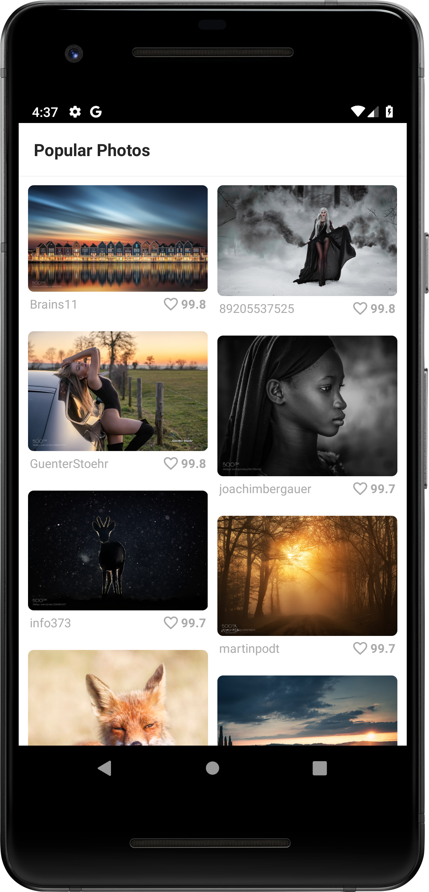
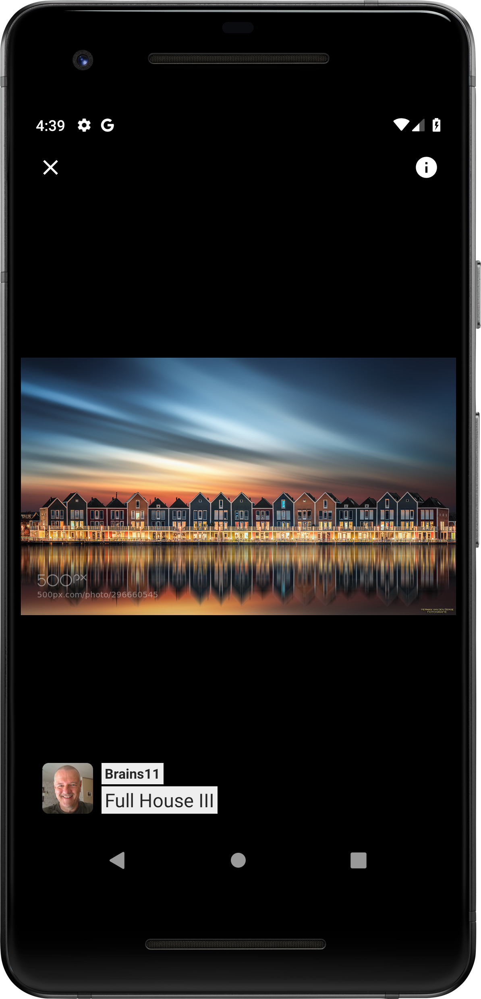

# 500px Popular Photos Demo

This is a demo app that showcases [popular photos](https://500px.com/popular) from [500px](https://500px.com/). This demo app uses the legacy 500px APIs to fetch the photo stream. You can find the API documentation here: https://github.com/500px/legacy-api-documentation

 

## Downloads

Download the latest version from [releases](../../releases).

## API Key

An API key is needed to access 500px's APIs. Configure the API key in `$HOME/.gradle/gradle.properties` 

```
# 500px API key
API_KEY=<YOUR API KEY>
```

## Technologies

- Kotlin
- Android X / Jetpack
- Android Architecture Components (ViewModel, LiveData & Paging)
- RxJava 2
- OkHttp / Retrofit / GSON
- Picasso
- PhotoView

Logging & debugging:

- Timber
- LeakCanary

## License

    Copyright (C) 2019 Subinkrishna Gopi
    
    Licensed under the Apache License, Version 2.0 (the "License");
    you may not use this file except in compliance with the License.
    You may obtain a copy of the License at
    
       http://www.apache.org/licenses/LICENSE-2.0
    
    Unless required by applicable law or agreed to in writing, software
    distributed under the License is distributed on an "AS IS" BASIS,
    WITHOUT WARRANTIES OR CONDITIONS OF ANY KIND, either express or implied.
    See the License for the specific language governing permissions and
    limitations under the License.
